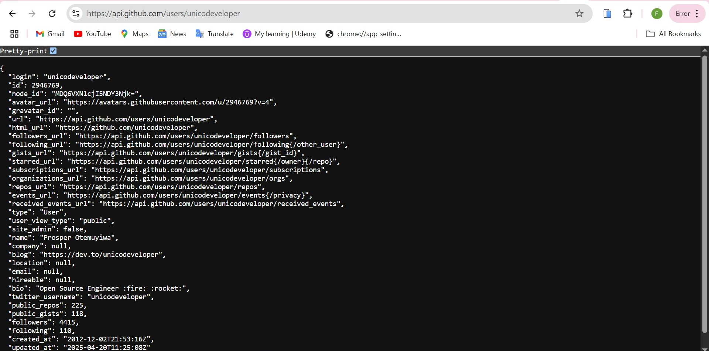

# [Month 1 Week 3]{.gradient-text}

<!-- CSS styling for .gradient-text class -->
<style>
    .gradient-text {
      background: linear-gradient(45deg, #4EC5D4 10%, #008080 20%);
      -webkit-background-clip: text;
      -moz-background-clip: text;
      -webkit-text-fill-color: transparent;
      -moz-text-fill-color: transparent;
      font-size: 2em; 
    }
   
</style>

---

## [🔌 API and Its Function]{.text-teal-400}

<br>

<v-clicks>

- The primary responsibility of a front end developer is to create pixel perfect UI and also
  to make the UI functional and usable.
- API’s are endpoints to Github. There is always a documentation on every API.
- You can make use of Github API to create a repository,and also use it to comment
- **FETCH** is used to make API’S calls .Making API’s calls is like you are talking to a particular backend/ endpoint.
- **XMLHttpRequest** can also be used to make API calls
- API’s are also used to submit forms.
- There are different ways to talk to the API’s which are : **GET**, **POST**.

</v-clicks>

---

**GET**

This is a single way to fetch information back to us.Example of the GET request is when you visit a browser.

  

---

**POST**

Basically means to send the browser an information to get back another information.
the browser cannot make a POST request as a first request inside a URL tab especially.

A very good example of POST is when you fill a form or sign up by inputting your name,address,email and other data and submit,then you log in and it returns a feedback which indicates that your information has been received. i.e a token,which can further be sent to another API called USERS.Then the `Headers` must be parsed in using the token which is encrypted with the user’s details. This confirms that it's the same user registered that is logged in.

**Code**

```js
Const response = await fetch (‘/api/users’ {git checkout
    method : ‘POST’,
headers : {
 ‘content-Type’ : ‘application/json’,
  }
body : JSON.stringify (user) ,
  })
const  result = await response.json ()
```  

---


>The code above shows the process using method POST and we get something called `headers` which is the ‘content-type’ called **AUTHORIZATION(BEARER)**.

<br>
<br>

Encryption and Decryption is used to store and reveal user ID using a form of token either cookies or local storage,session etc.
Backend must have a documentation for the frontends to rely on by providing API’s to communicate with.They are the intermediary between frontend and the database.
There are several tools that can give us the same interface of API’s, example is the **Github API Docs**.They can be used to create repositories using tokens.

---


 **Using Curls in the command line**.

<v-clicks>

- Install curl if it isn't already installed on your machine. To check if curl is installed, execute curl --version in the command line.
- Create an access token. For example, create a personal access token or a GitHub App user access token. You will use this token to authenticate your request, so you should give it any scopes or permissions that are required to access the endpoint.

</v-clicks>

<br>

### GitHub API Request

```bash

curl --request GET \
  --url "https://api.github.com/repos/octocat/Spoon-Knife/issues" \
  --header "Accept: application/vnd.github+json" \
  --header "Authorization: Bearer YOUR-TOKEN"
```

---


- In most cases, you can use `Authorization: Bearer`or `Authorization: token` to pass a token. However, if you are passing a JSON web token (JWT), you must use Authorization: Bearer.

<br>

>There are API's used to generate token and auntheticate ID's.We have **WEATHER API'S**,**JSONPLACEHOLDER**.
>There is an npm package called **JSONSERVER** used to create API'S when there is no API that meets
>our needs by creating a fake data that looks like JSON.

<br>

### URLs


Javascript provides a built in URL class that makes working with URL easier and safer.The URL object provides a convenient method to parse in URLs.

---


```js
const url = new URL("https://example.com/products?id=123&category=books");

console.log(url.href); // "Full URL: "https://example.com/products?id=123&category=books"
console.log(url.origin); // "https://example.com"
console.log(url.protocol); // "https:"
console.log(url.hostname); // "example.com"
console.log(url.pathname); // "/products"
console.log(url.search); // "?id=123&category=books"
console.log(url.hash); // "" (empty if not present)
console.log(url.searchParams.get("id")); // "123"
console.log(url.searchParams.get("category")); // "books"

url.searchParams.set("category", "fiction"); // Update parameter
url.searchParams.append("sort", "price"); // Add new parameter
url.searchParams.delete("id"); // Remove a parameter

console.log(url.toString()); // New URL after changes

const newUrl = new URL("https://example.com/page");
newUrl.searchParams.set("user", "alice");
newUrl.searchParams.set("mode", "edit");

console.log(newUrl.toString());
// Output: "https://example.com/page?user=alice&mode=edit"
```


