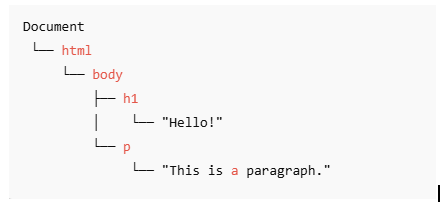

# [Month 1 Week 4]{.gradient-text}

<!-- CSS styling for .gradient-text class -->
<style>
    .gradient-text {
      background: linear-gradient(45deg, #4EC5D4 10%, #008080 20%);
      -webkit-background-clip: text;
      -moz-background-clip: text;
      -webkit-text-fill-color: transparent;
      -moz-text-fill-color: transparent;
      font-size: 2em; 
    }
   
</style>

---

## [🌐 BOM, DOM, and CSSOM]{.text-teal-400}

<br>

### BOM (Browser Object Model)


- BOM is the interface between JavaScript and the browser.
- It allows JavaScript to interact with the **browser itself** — such as:
  - The window
  - Tabs
  - URLs
  - Alerts 

<br>

### CSSOM (CSS Object Model)

- CSSOM is the interface between JavaScript and CSS.
- It allows JavaScript to interact with and **manipulate CSS styles**.
- It's how the browser represents **all the CSS** (from `<style>`, external files, or JavaScript) as an object model.

---

### [🌳 DOM (Document Object Model)]{.text-teal-400}

<br>

<v-clicks>

- DOM is the interface between JavaScript and **HTML + CSS**.
- It represents the web page as an **object tree structure**.
- JavaScript uses the DOM to read, access, and change elements on the page.
- DOM is a **tree-like structure** converted from HTML tags.
- These HTML elements are connected by **nodes** (element nodes, text nodes, etc.).

</v-clicks>

 **The Nodes**

- The entire HTML document is the **document node**, which is the **root** of the DOM.
- `<html>`, `<body>`, `<h1>`, and `<p>` are **element nodes**.
- `"Hello!"` and `"this is a paragraph"` are **text nodes**.

---

### Illustrative Example of DOM Nodes


<br>
```html
<!DOCTYPE html>
<html lang="en">
<head>
    <meta charset="UTF-8">
    <meta name="viewport" content="width=device-width, initial-scale=1.0">
    <title>JS DOM</title>
</head>
<body>
    <h1 >Hello!</h1>
    <script>
        document.querySelector("h1").textContent = "New Heading!";
        document.querySelector("h1").style.color = "red";
    </script>
    <p>This is a paragraph.</p>
    <script src="index.js"></script>

</body>
</html>
```

---

**The nodes**



**Changing the style the content of an html page**


```html
<h1 >Hello!</h1>
    <script>
        document.querySelector("h1").textContent = "New Heading!";
        document.querySelector("h1").style.color = "red";
    </script>
    <p>This is a paragraph.</p>
```

---

**Answer to the Assignment question**

```js
// creating a div element

const textDiv = document.createElement("div");

// now let's create a paragragh in the div
const textPara = document.createElement("p");

// adding text
textPara.textContent =
  "See you on the other side, where we will discuss events in JavaScript. May the force be with you.";
textDiv.appendChild(textPara);

document.body.appendChild(textDiv);
(textPara.style.fontFamily = "Georgia"), serif;
textPara.style.fontStyle = "italic";
```