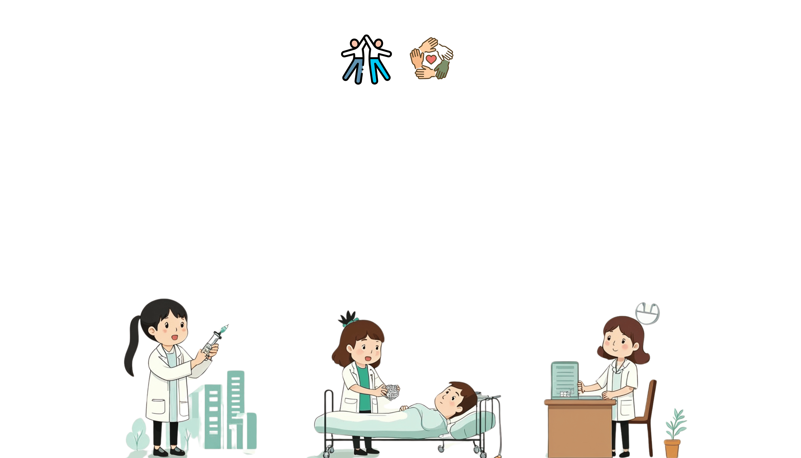

  <h1 class="gradient-text">Basics of Antimicrobial Stewardship in Hospitals</h1>
  
  

    Ugwuja Anthony C.<carbon:arrow-right />
  

<!-- Slides for background -->
---
src: ./pages/background.md
---

---
src: /pages/content1.md
---

---
src: ./pages/content2.md
---

<!-- Slides for month1 week4 -->

---
src: ./pages/content3.md
---

<!-- Slides for month2 week1 -->

---
src: ./pages/content4.md
---

---
src: ./pages/content5.md
---

<!-- Slides for month2 week3 -->

---
src: ./pages/content6.md

<!-- Slides for month2 week4 -->

<!-- ---
src: ./pages/mth2-wk4.md
--- -->

<!-- Slides for extra class week1 -->

<!-- ---
src: ./pages/extra-class1.md
--- -->

<!-- Slides for extra class week1 -->

<!-- ---
src: ./pages/extra-class2.md
--- -->

<!--  -->

<!--  -->

